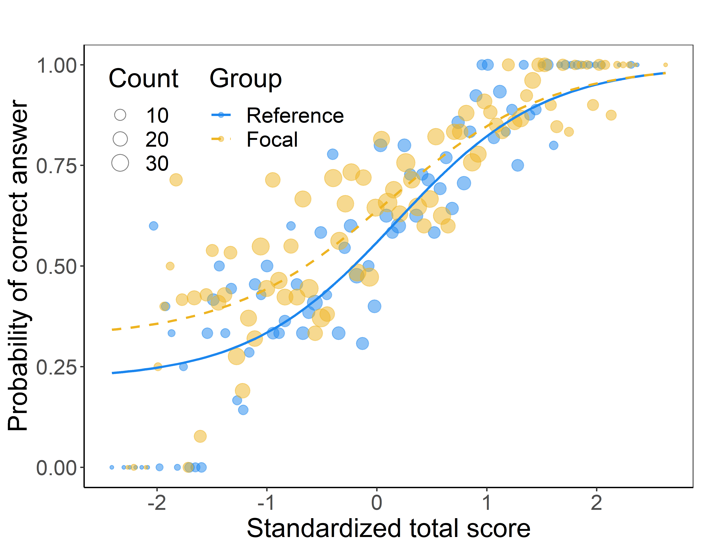
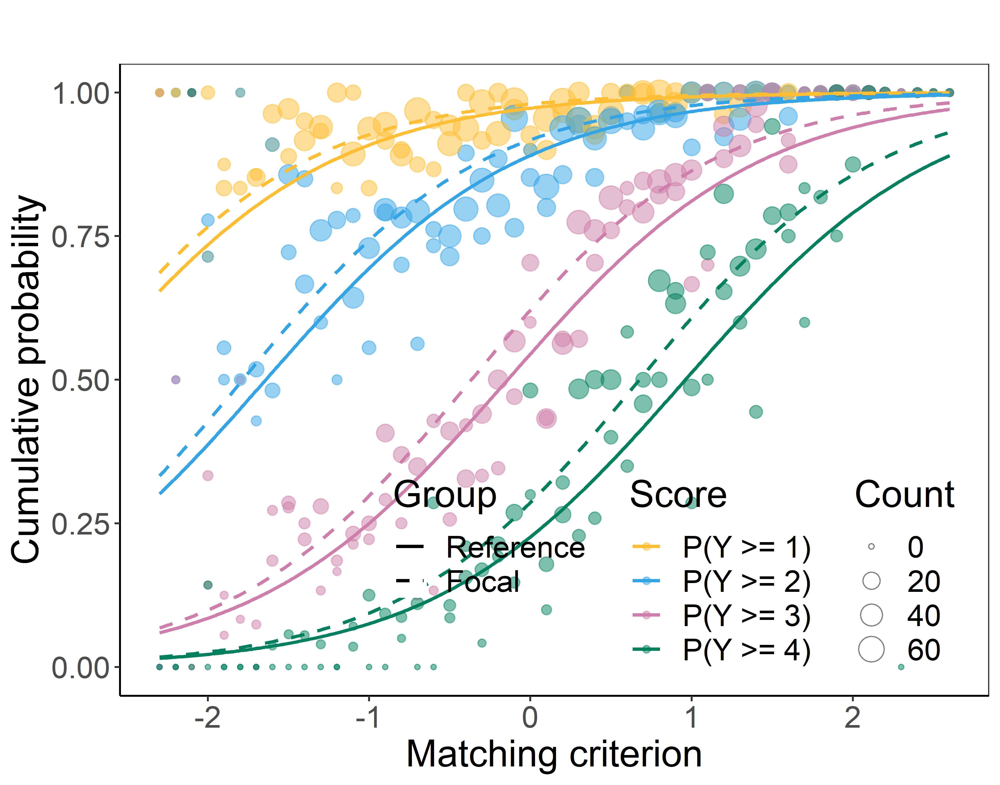

# difNLR
DIF and DDF Detection by Non-Linear Regression Models.


[](https://CRAN.R-project.org/package=difNLR)


## Description
The difNLR package contains method for detection of differential item
functioning (DIF) based on non-linear regression. Both uniform and non-uniform
DIF effects can be detected when considering one focal group. The method also
allows to test the difference in guessing or inattention parameters between
reference and focal group. DIF detection method is based either on
likelihood-ratio test, F-test, or Wald's test of a submodel. Package also offers
methods for detection of differential distractor functioning (DDF) based on
multinomial log-linear regression model and newly methods for DIF detection
among ordinal data via adjacent category logit and cumulative logit regression
models.

<p align="center">
   
   
   
</p>


## Installation
The easiest way to get `difNLR` package is to install it from CRAN:
```
install.packages("difNLR")
```
Or you can get the newest development version from GitHub:
```
# install.packages("devtools")
devtools::install_github("adelahladka/difNLR")
```
## Version
Current version on [**CRAN**](https://CRAN.R-project.org/package=difNLR) is
1.4.1. The newest development version available on
[**GitHub**](https://github.com/adelahladka/difNLR) is 1.4.1-1.

## Reference
To cite `difNLR` package in publications, please, use:

  Hladka, A. & Martinkova, P. (2020). difNLR: Generalized logistic regression models for DIF and DDF detection. 
  The R Journal, 12(1), 300--323, [doi: 10.32614/RJ-2020-014](https://doi.org/10.32614/RJ-2020-014).

  Drabinova, A. & Martinkova, P. (2017). Detection of Differential Item Functioning with
  Nonlinear Regression: A Non-IRT Approach Accounting for Guessing. Journal of
  Educational Measurement, 54(4), 498--517, [doi: 10.1111/jedm.12158](https://doi.org/10.1111/jedm.12158).
  
## Try online
You can try some functionalities of the `difNLR` package
[online](https://shiny.cs.cas.cz/ShinyItemAnalysis/) using
[`ShinyItemAnalysis`](https://github.com/patriciamar/ShinyItemAnalysis)
application and package and its DIF/Fairness section.
  
## Getting help
In case you find any bug or just need help with `difNLR` package, you can leave
your message as an issue here or directly contact us at hladka@cs.cas.cz
