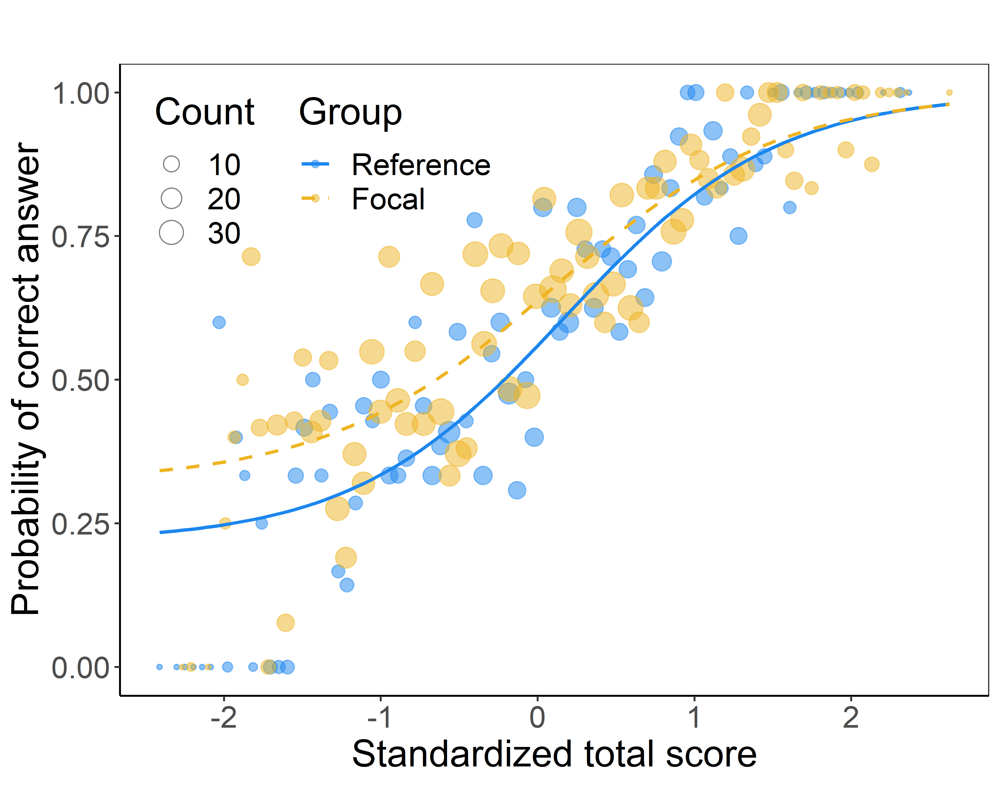
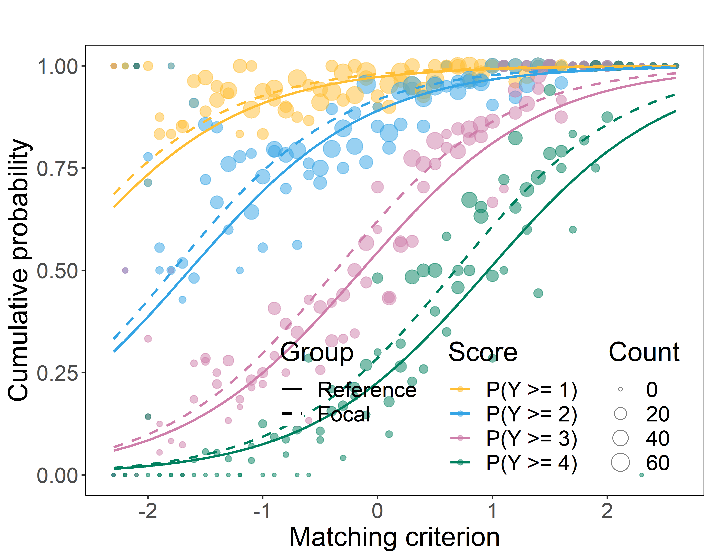
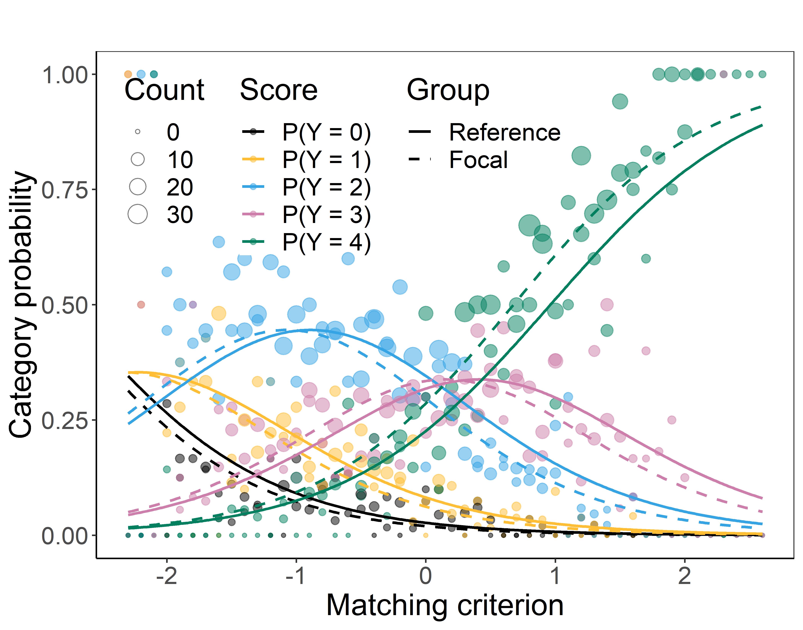

# difNLR

DIF and DDF Detection by Non-Linear Regression Models.

## Description

The **difNLR** package provides methods for detecting differential item
functioning (DIF) using non-linear regression models. Both uniform and
non-uniform DIF effects can be detected when considering a single focal
group. Additionally, the method allows for testing differences in
guessing or inattention parameters between the reference and focal
group. DIF detection is performed using either a likelihood-ratio test,
an F-test, or Wald’s test of a submodel. The software offers a variety
of algorithms for estimating item parameters.

Furthermore, the **difNLR** package includes methods for detecting
differential distractor functioning (DDF) using multinomial log-linear
regression model. It also introduces DIF detection approaches for
ordinal data via adjacent category logit and cumulative logit regression
models.

## Installation

The easiest way to get **difNLR** package is to install it from CRAN:

    install.packages("difNLR")

Or you can get the newest development version from GitHub:

    # install.packages("devtools")
    devtools::install_github("adelahladka/difNLR")

## Version

Current version on [**CRAN**](https://CRAN.R-project.org/package=difNLR)
is 1.5.2-2. The newest development version available on
[**GitHub**](https://github.com/adelahladka/difNLR) is 1.5.3.

## Reference

To cite the **difNLR** package in publications, please, use:

&nbsp;

To cite new estimation approaches provided in the
[`difNLR()`](https://adelahladka.github.io/difNLR/reference/difNLR.md)
function, please, use:

## Try online

You can try some functionalities of the **difNLR** package
[online](https://shiny.cs.cas.cz/ShinyItemAnalysis/) using the
[**ShinyItemAnalysis**](https://github.com/patriciamar/ShinyItemAnalysis)
application and package and its DIF/Fairness section.

## Getting help

In case you find any bug or just need help with the **difNLR** package,
you can leave your message as an issue here or directly contact us at
<hladka@cs.cas.cz>
